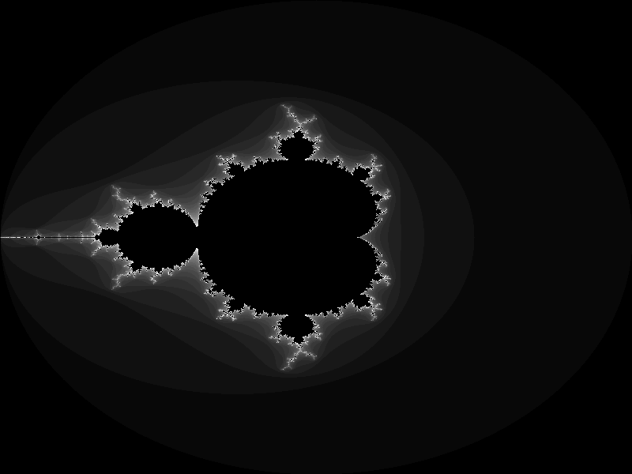

Call C from Ada
===============

It's really easy.

I've written the C function first. Since there was a textual
Mandelbrot generator already
([mandel_utf.adb](https://github.com/shintakezou/adaplayground/blob/master/src/mandel_utf.adb)),
I decided to do a graphical, non interactive, version, and to generate a PNG image file.

Digged a little bit for a basic example to start (and end) with, and
`create_image` is born.

Then I've compiled it with

    gcc pngfunc.c -fdump-ada-spec -c
	
The `-fdump-ada-spec` generates all you need, and a lot more. Hence
I've deleted what I didn't need and cleaned up what I needed. At the
end, `stdint_h.ads` and `pngfunc_c.ads` were the only needed files.

I had already, almost!, the Ada part: few `with` and `use` more... In
particular children packages of `Interfaces`, and  the above
mentioned files generated by `-fdump-ada-spec`.

Then, replace the code printing the textual Mandelbrot with the call
to the C function. That is, `Dump_Bitmap` needed to be rewritten.

Since `Data`, the argument of `Dump_Bitmap`, is the same as before,
I did a data conversion to stuff the bytes into an array of unsigned
chars (unsigned 8bit integers). The interesting bit is

```ada
      type Buffer is array (Buffer_Index range <>) of aliased uint8_t 
      with
        Component_Size => 8,
        Convention => C;
```

Not sure the aspects are needed (if you remove them, it works anyway).

This is what you need to translate C's `uint8_t *`, but it isn't
enough: the generic `Interfaces.C.Pointers` does the trick. This is
the only complicated, if you think so, part.

If you succeed compiling and running it, this is the wonderful sight:



The procedure `To_RGB` exists to experiment with colors.

